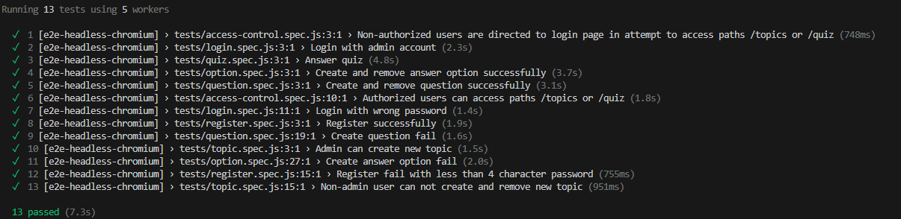

# Project 2: Drill and practice

This a web application that is used for repeated practice of learned content. The application provides a list of topics and allows creating multiple-choice questions into those topics that are then answered by self and others. The application also shows basic statistics: the total number of available questions and the total number of question answers. In addition, the application also provides an API for retrieving and answering random questions.

## Run the application locally

User [docker-compose](https://docs.docker.com/compose/install/) to run the whole application (database included).

```bash
docker compose up
```

Then the application launches on the port 7777 by default

You can access application by localhost:7777

## Online location

You can access application by [the link](https://drill-and-practice-orse.onrender.com/)

## Testing

There are 13 end-to-end tests written in [e2e-playwright](e2e-playwright) folder including tests for:
1. Access control
2. Login
3. Registration
4. Creating topic
5. Creating and removing question
6. Creating and removing answer option
7. Answering quiz

End-to-end tests can be run using [docker-compose](https://docs.docker.com/compose/install/).
1. Remove current containers to clear data in local database first:
```bash
docker compose rm -sf
```
2. Run the tests:
```bassh
docker compose run --entrypoint=npx e2e-playwright playwright test && docker compose rm -sf
```
The result after running test would be like this:



If some tests fail, it might be because the data in database has not been cleared before running the tests, which is done by 
```bash
docker compose rm -sf
```

<!-- Write the documentation of your project here. Do not include your personal
details (e.g. name or student number).


Remember to include the address of the online location where your project is
running as it is a key part of the submission. -->
